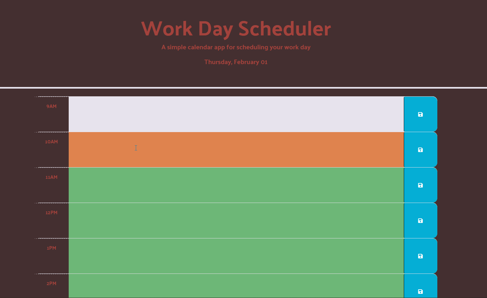

# 05 Third-Party APIs: Work Day Scheduler

## Description

This week's challenge was to add the script elements to a daily planner that follows the average 9am&mdash;5pm work day schedule. The date at the top of the page is updated automatically using the dayjs library. Additionally, each time block changes color based on the current local time.

The planner has the ability to save data to the user's local storage when the blue save button is pressed, and this data will persist upon refreshing/closing of the page as demonstrated in the screenshot below.

## Live Website and Demonstration Screenshot

[Link to Live Application](https://nihsad.github.io/work-day-scheduler/)
